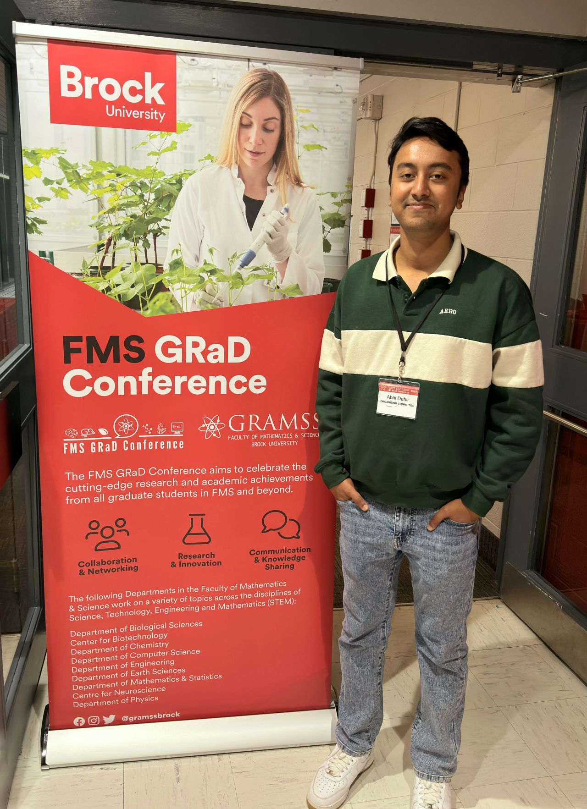
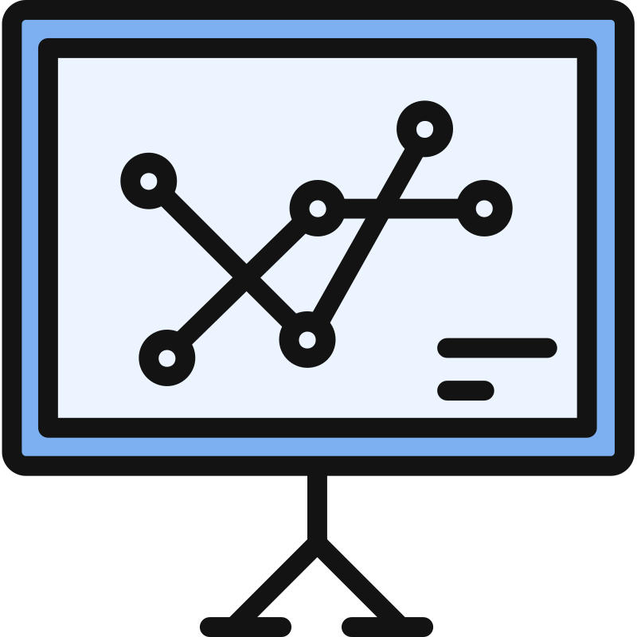
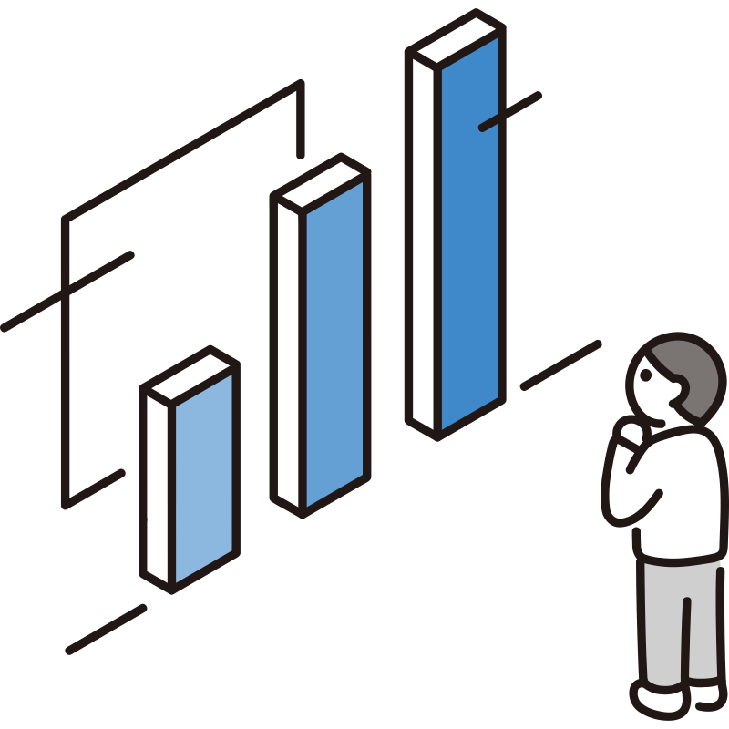

## Social Media Links

    <a href="https://www.linkedin.com/in/abhijeet-dhali" target="_blank" aria-label="LinkedIn">
        <i class="fab fa-linkedin"></i>
    </a>
    <a href="https://github.com/AbhiJeet70" target="_blank" aria-label="GitHub">
        <i class="fab fa-github"></i>
    </a>
    <a href="mailto:abhi041096@gmail.com" target="_blank" aria-label="Email">
        <i class="fas fa-envelope"></i>
    </a>

I am a **Graduate Research Assistant** and **Interim Secretary** at **Brock University**, actively working on cutting-edge research in **Federated Learning** and **Knowledge Graph Embedding**. I have a strong background in machine learning, data science, and software development, and I enjoy contributing to open-source projects and collaborating on innovative solutions.

    

    

## Experience

### Graduate Research Assistant, **Brock CS Department**  
_Ongoing_

- Ongoing research in **Graph Neural Networks (GNN)**, **Federated Learning with Graph Data**, and the **Robustness of GNN**.
- Contributing to a research project on **backdoor attacks** on **EV charging stations** and **airports** using GNNs.
- Improving the robustness of GNNs and evaluating federated learning algorithms for decentralized environments.

### Interim Secretary, **Graduate Math and Science Students Brock University (GRAMSS)**  
_Ongoing_

- Organizer of **FMS GRaD Conference 2024** at Brock University.
- Managed meetings, prepared agendas, and supported faculty in organizing seminars.

### Research Project, **Undergraduate Thesis**  
_March 2020 – Dec 2021_

- Developed a **GPS-Guided Autonomous Drone** for delivery purposes.

### Machine Learning Project  
_April 2020 – April 2021_

- Created a **Machine Learning-based Diabetes Prediction Web Application**.

### Industrial Trainee, **Grameenphone Ltd.**  
_Aug 2019 – Sep 2019_

- Gained experience in **Radio Planning**, **Network Security**, and **IP Architecture**.

## Skills

| **Skill Category**      | **Details**                                                  |
|-------------------------|--------------------------------------------------------------|
| **Programming**          | C, C++, Java, Python                                         |
| **Python Libraries**     | NumPy, Pandas, Matplotlib, Scikit-Learn, Pytorch              |
| **Web Development**      | HTML, CSS, PHP, Bootstrap, JavaScript, Node.js, React.js      |

## Education

### Master of Science, Computer Science  
**Brock University, Ongoing**  
_September 2023 – September 2025_

### Bachelor of Science, Computer Science and Engineering  
**Chittagong University of Engineering and Technology**  
_February 2016 – September 2022_
